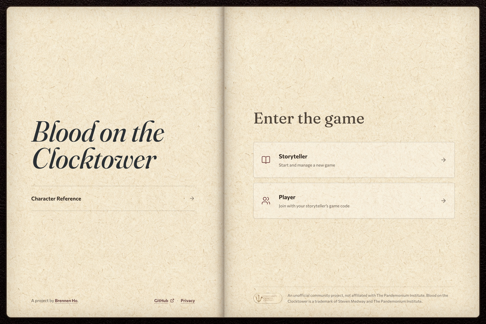
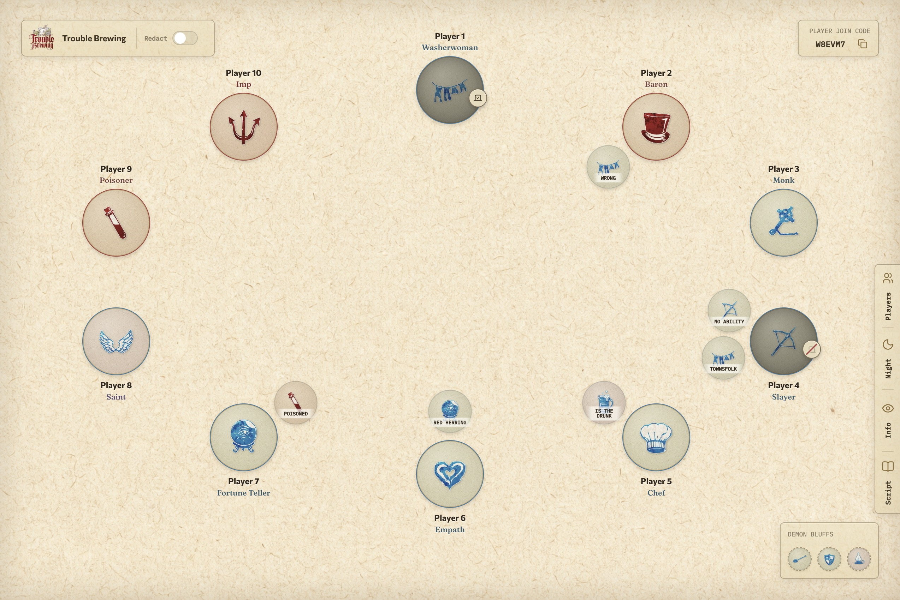
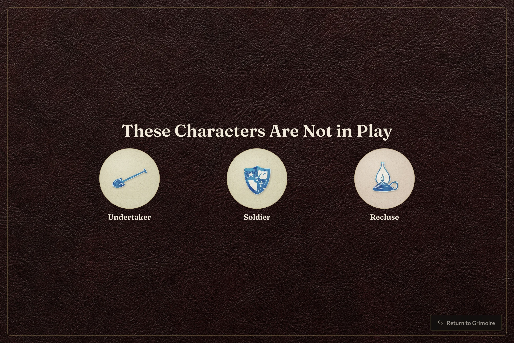
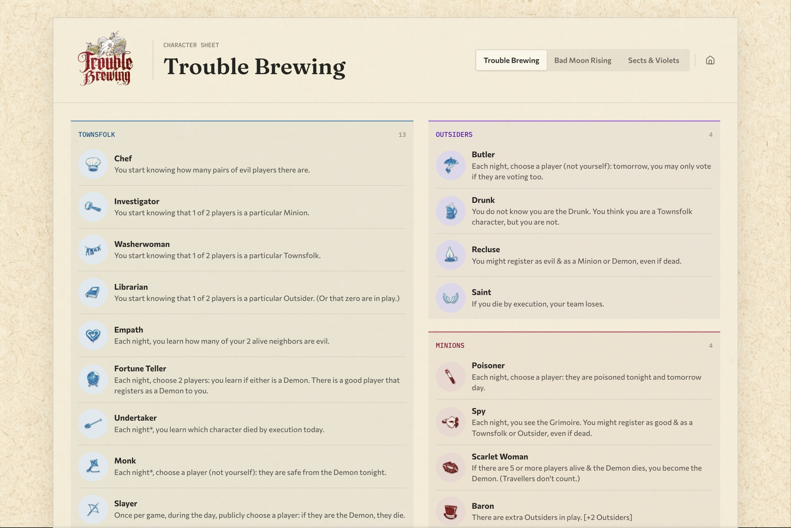

# Blood on the Clocktower

An unofficial online grimoire for running [Blood on the Clocktower](https://bloodontheclocktower.com/) either in person or online.

> Learn more about Blood on the Clocktower from the [wiki](https://wiki.bloodontheclocktower.com/Main_Page).

This project gives Storytellers a shared digital grimoire.
It intentionally does not automate gameplay and is meant to be used with a human Storyteller.

The grimoire can manage characters, reminders, alignment, voting, and more. Players can connect from their own devices and follow along.

> [!NOTE]
> This is a community-made project and is not affiliated with or endorsed by The Pandemonium Institute.



## Features

- A private Storyteller grimoire arranged around the town circle.
- Player joining and live presence through a short game code.
- Character assignment and private player role reveals.
- Life, alignment, reminder-token, Demon-bluff, and day/night tracking.
- Storyteller night order and information-token references.
- Trouble Brewing, Bad Moon Rising, and Sects & Violets character sheets.
- Responsive layouts for running a game from a laptop, tablet, or phone.

## Playing a Game

1. The Storyteller selects an edition and player count, then opens a new
   grimoire.
2. Players choose **Player**, enter the game code and their name, and join the
   town from their own device.
3. The Storyteller assigns characters and uses the grimoire, reminders, night
   order, and information panels to run the game.

Character reference sheets are also available without creating a game.

## Preview

### The Grimoire



### In-Person Game Information



### Character Reference Sheet



## Local Setup

### Requirements

- Node.js 20.9 or newer
- pnpm 9
- Docker

### Run locally

1. Install the dependencies:

   ```sh
   pnpm install
   ```

2. Copy `.env.example` to `.env`.
3. Start Supabase and apply the migrations and preview seed:

   ```sh
   pnpm supabase:start
   pnpm supabase:reset
   pnpm supabase:status
   ```

4. Copy the local API URL, publishable key, and secret key reported by
   `supabase:status` into the matching variables in `.env`.
5. Start the application:

   ```sh
   pnpm dev
   ```

Open [http://localhost:3000](http://localhost:3000).
See [DEVELOPMENT.md](docs/DEVELOPMENT.md) for environment
variables, database migrations, observability, asset syncing, and deployment checks.

## Verification

```sh
pnpm check
pnpm test
pnpm build
```

Multiplayer browser tests additionally require the local Supabase stack:

```sh
pnpm supabase:start
pnpm supabase:reset
pnpm test:integration
```

Additional database and dependency checks are documented in the
[development guide](docs/DEVELOPMENT.md#verification).

## License

Original software and documentation are licensed under the [MIT License](LICENSE).
Blood on the Clocktower material and other third-party content are not covered
by that license. See [Third-Party Notices](THIRD_PARTY_NOTICES.md) for details.

## Acknowledgements

- Blood on the Clocktower was created by Steven Medway and is published by
  [The Pandemonium Institute](https://bloodontheclocktower.com/).
- Official character data and artwork come from TPI's
  [toolmaker resources](https://release.botc.app/resources/) and remain subject
  to its
  [Community Created Content Policy](https://bloodontheclocktower.com/pages/community-created-content-policy).
- This project was created by [Brennen Ho](https://brennen.dev).

Blood on the Clocktower is a trademark of Steven Medway and The Pandemonium
Institute. This project is not affiliated with or endorsed by The Pandemonium
Institute.
